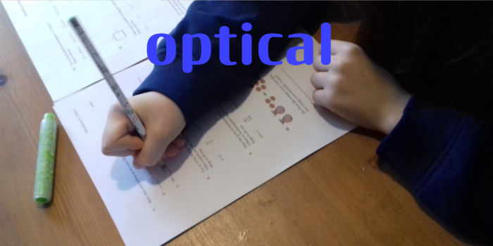

<!-- README.md is generated from README.Rmd. Please edit that file -->

```{r, include = FALSE}
knitr::opts_chunk$set(
  collapse = TRUE,
  comment = "#>",
  fig.path = "man/figures/README-",
  out.width = "100%"
)
```

# 

# optical

<!-- badges: start -->

  [](https://github.com/scenic555/optical/actions/workflows/R-CMD-check.yaml) [](https://CRAN.R-project.org/package=optical) [](https://github.com/scenic555/optical/actions/workflows/test-coverage.yaml) [](https://github.com/scenic555/optical/actions/workflows/pages/pages-build-deployment)

[](https://github.com/scenic555)

<!--[](https://app.codecov.io/gh/scenic555/optical?branch=main)-->

<!-- badges: end -->

`optical` package provides function that are used for Optimal Item Calibaration in computerized achievement tests

## Installation

The easiest way to install the [**optical**](https://scenic555.github.io/optical/) package from CRAN using:

``` r
install.packages("optical")
```

You can install the development version of [**optical**](https://scenic555.github.io/optical/) from [GitHub](https://github.com/) with the following code:

``` r
# if not installed already on your computer, install devtools
install.packages("devtools")

# Install the package
devtools::install_github("scenic555/optical")

# Load the optical package
library(optical)
```

## Example

This is a basic example which shows you how to solve a common problem:

```{r example}
library(optical)
# 1PL-models with common discrimination parameter
ip <- cbind(c(1.6, NA), c(-1, 1))

yyy <- optical(ip, oc="D", uncert=FALSE, ipop,
               imf=c(0.005, 0.01, 0.02, 0.05, 0.1, 0.2, 0.45),
               maxiter=rep(300, 6), eps=rep(0.002, 6),
               nnn=c(0, 50, 50, 200, 200, 200),
               nsp=c(0.001, 0.0001, 0.0001, 0.00001, 0.00001, 0.00001),
               sss=0.001, falpha=1.08, ig=3, ex=0)

drawdesign(yyy=yyy, ip=ip, ylowl=-1000, refline=0.002, layout=1)
```

# Licence

This package is free and open source software, licensed under GPL (\>= 3).

# References

Ul Hassan and Miller (2021). An exchange algorithm for optimal calibration of items in computerized achievement tests. Computational Statistics and Data Analysis, 157: 107177. <https://doi.org/10.1016/j.csda.2021.107177>

Bjermo, Fackle-Fornius, and Miller (2021). Optimizing Calibration Designs with Uncertaintyin Abilities. Manuscript. [urn:nbn:se:su:diva-198065](https://urn.kb.se/resolve?urn=urn%3Anbn%3Ase%3Asu%3Adiva-198065)
